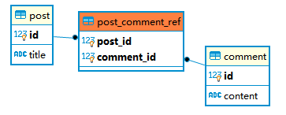

## 结论在前：

1. JPA的数据库映射DAO中，避免使用lombok的@Data注解，推荐手写getter和setter方法，避免发生[HHH000100: Fail-safe cleanup错误]([https://stackoverflow.com/questions/53540056/what-casuses-spring-boot-fail-safe-cleanup-collections-to-occur](https://stackoverflow.com/questions/53540056/what-casuses-spring-boot-fail-safe-cleanup-collections-to-occur))
2. JPA定义关联关系时，尽量避免显示使用 `FetchType.EAGER` ，推荐使用默认的 `FetchType.LAZY` 以避免意外行为的发生（如下文的情况）

## 意外行为情况
例如post博客对象和comment评论对象，这两个对象关系是

- post[1]—>comment[*]
- comment[1]—>post[1]

### ER图



定义这两个数据库映射

`Post.java`

```java
@Entity
@Table(name = "post")
public class Post{
    @Id
    @Column(name = "id")
    private Long id;

    @Column(name = "title")
    private String title;

		@OneToMany(fetch = FetchType.LAZY)
    @JoinTable(
            name = "post_comment_ref",
            joinColumns = @JoinColumn(name = "post_id"),
            inverseJoinColumns = @JoinColumn(name = "comment_id")
    )
    private List<Comment> comments;

    public Long getId() {
        return id;
    }

    public void setId(Long id) {
        this.id = id;
    }

    public String getTitle() {
        return title;
    }

    public void setTitle(String title) {
        this.title = title;
    }

		public List<Post> getComments() {
        return comments;
    }

    public void setComments(List<Post> comments) {
        this.comments = comments;
    }

}
```

`Comment.java`

```java
@Entity
@Table(name = "comment")
public class Comment{
    @Id
    @Column(name = "id")
    private Long id;

    @Column(name = "content")
    private String content;

		@ManyToOne(fetch = FetchType.LAZY)
    @JoinTable(
            name = "post_comment_ref",
            joinColumns = @JoinColumn(name = "comment_id"),
            inverseJoinColumns = @JoinColumn(name = "post_id")
    )
    private Post post;

    public Long getId() {
        return id;
    }

    public void setId(Long id) {
        this.id = id;
    }

    public String getContent() {
        return title;
    }

    public void setContent(String content) {
        this.content = content;
    }

		public Post getPost() {
        return post;
    }

    public void setPost(Post post) {
        this.post = post;
    }
}
```

这里描述一对多关系使用的是@JoinTable这个注解，需要数据多一张post和comment主键关联的表来存储这个关联关系，因此在每次关联查询需要使用join联表查询，这里因为fetch开关的不同遇到了坑， 坑触发的条件为：

1. comment中 `@ManyToOne`的fetch设置为 `FetchType.EAGER`
2. comment(id=1)没有关联的post数据，即post_comment_ref表中无主键的关联数据
3. 通过commentDao.findById(1)查询时，返回为空，但主键为1的comment数据是存在的，只是没有与之关联的post数据

查看JPA打印的sql分析，其自动生成的sql为

```sql
select c.id , c.title , r.post_id , p.id , p.content from comment c 
left outer join post_comment_ref r on c.id = r.comment_id inner join post p on r.post_id = p.id where c.id = 1
```

其中 `inner join` 导致了comment本身的数据都未查到，而预期返回的结果是comment对象有数据，其post属性为null，即预期`inner join` 应该是 `left join` 

此处为 `FetchType.EAGER` 导致，修改为 `FetchType.LAZY` ，行为符合预期，在查询comment时，只查询关联的post_id，只有调用 `comment.getPost()`才执行post表的单独查询

```sql
//comment = commentDao.findById(1).get()触发
select c.id , c.title , r.post_id from comment c 
left outer join post_comment_ref r on c.id = r.comment_id where c.id = 1

//comment.getPost()调用触发
//post_id其实为null
select p.id , p.content from  post p where c.id = null
```