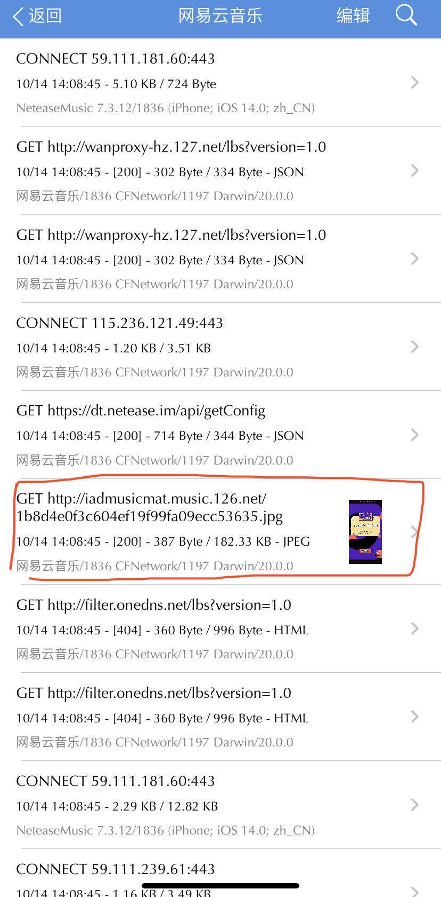
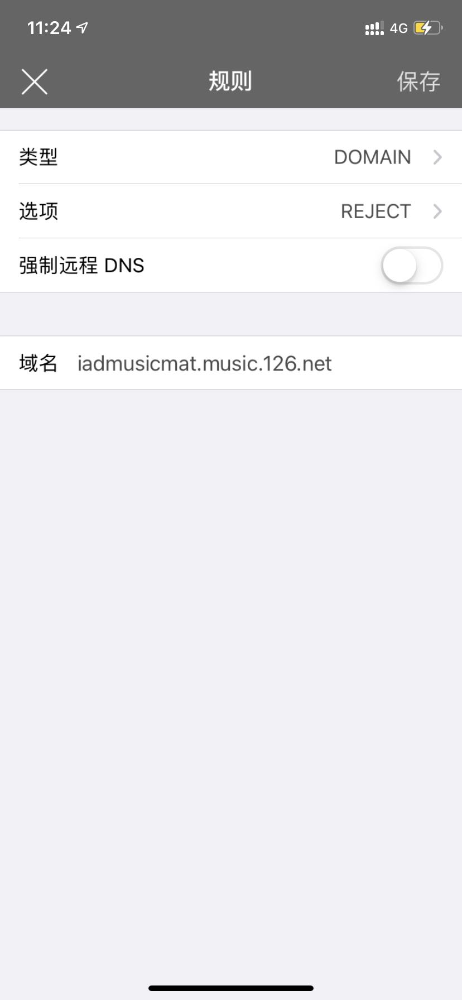

## 必备软件
- VPN软件，用于网络过滤拦截(如我经常用的[shadowrocket](https://apps.apple.com/us/app/shadowrocket/id932747118),但需要美区购买下载)
- 手机抓包软件，如我用的免费软件[stream]https://apps.apple.com/cn/app/stream/id1312141691)

## 过滤规则
使用小火箭（shadowrocket）后，可以使用其他人已整理分享的过滤规则[Shadowrocket-ADBlock-Rules](https://github.com/h2y/Shadowrocket-ADBlock-Rules)，其中已经包含了很多广告地址；当然规则是通过静态的配置文件写死的，app若换用广告地址，原来是过滤规则就会失效，因此，若想持续实现广告过滤，只能手动来抓包更新其广告地址，然后继续实现拦截。

## 屏蔽ios网易云音乐开屏广告
演示屏蔽网易云音乐ios客户端的开屏广告步骤
### 具体步骤
如果已经安装并使用了网易云音乐的话，需要手动在app中清理图片缓存或者删除后重新安装，否则，app可以使用本地图片，而无法触发抓包。
1. 开启stream的抓包功能，然后启动网易云音乐app，等待开屏广告出现时即刻返回stream并停止抓包。
2. 在抓包数据中尝试寻找广告图片，有些图片域名地址可以明显识别出是广告域名，如这里网易云音乐的广告域名是`iadmusicmat.music.126.com`
   
3. 在shadowrocket的过滤配置文件中增加地址映射，此广告域名的地址一律拒绝请求
   
4. 常年运行shadowrocket的配置模式即可屏蔽网易云音乐的开屏广告

## 存在的缺点
以上只是我举的最简单屏蔽广告的例子，可以适用到其他app的广告屏蔽，包括app内的。但存在以下明显缺点：
1. 繁琐，需要手动识别广告图片，并需要注意避免拦截正常的地址
2. app的广告地址不是域名形式的，是直接请求的ip地址，这样的屏蔽策略意味着很容易失效。
3. 已经下载使用过的app，即使清理缓存后，有些app也会加载到缓存图片(鸡贼app，清理缓存竟然不清理广告图片)，除非删除重新安装，否则难以触发抓包