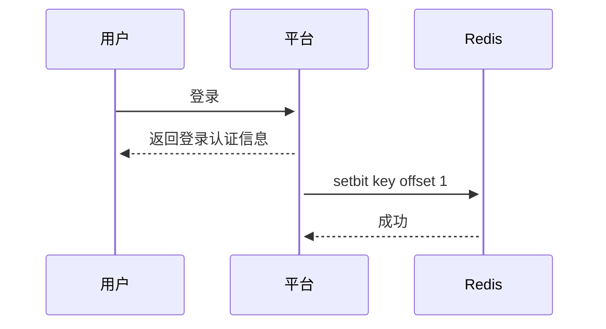

---
layout: post
title:  使用Redis实现用户活跃度统计
tags:
- redis
date: 2022-09-30 16:07:00
comments: true
--- 

## 业务需求
用户活跃度统计的业务场景，常见需求有：
- 平台日活、月活、季活
- 连续7天登录的用户数

实际有很多统计的维度，此处以上面两个场景为例，来讨论如何使用Redis进行帮助我们快速统计

## 设计思考
以** <日期，Set<用户id>> **这样的数据结构来存储日活用户很简单直接，可以方便的通过set的大小得到某天的用户数量和登录的具体用户，但是这样的数据结构很占用内存，可以简单计算下：  如用户id为32位无符号的integer值，每个用户id占用4bytes，10亿个用户一天的登录数据占用**10^8*4/1024/1024=381MB**，可见这样进行存储不现实，需要对存储的数据结构进行优化。因此，这里引入一个新的数据结构，Redis中也支持了多种命令来操作这样的数据结构：位图 bitmap

### 位图 bitmap
位图也叫bitmap，是一种常见的数据结构，每个bit位标识0或者1的状态，用于记录大量的0和1的状态。在用户日活的场景下，用户id代表bit的偏移量，每个bit位代表每个用户是否登录，因此10亿用户所需空间为**10^8/8/1024/1024 = 11.92 MB**的空间。实际对Redis进行测试也可以验证其占用大小约等于11.92MB：
```sh
$ setbit userLogin:2022-10-01 100000000 1
0
$ MEMORY USAGE userLogin:2022-10-01
12500055
```
因此，在用户量10亿级别存储一天的登录情况占用的内存空间很小。这里需要注意的是，Redis中
bitmap的offset偏移量最大值为2^32 - 1，因此在Redis中[bitmap最大占用512MB空间](https://redis.io/commands/setbit)，Redis在setbit超过当前最大偏移量时自动扩展内存来满足新的offset，因此在扩大或者初次赋值时会进行内存申请，后续offset在已申请的范围时可以直接赋值。
## 方案实现
用户登录时保存登录信息流程如下：

这里将每天的登录信息保存在以`userLogin:YYYY-mm-dd`格式的key中，如2020年10月1号的key为`userLogin:2022-10-01`，通过用户id得到位图的偏移量后设置其为1 `setbit userLogin:2022-10-01 用户offset 1`，最后记录了当天此用户的登录状态。
### 日活
日活就是平台某天的用户登录总数，通过计算当天bitmap中bit为1的个数即为当天的日活数。借助Redis内置的[BITCOUNT](https://redis.io/commands/bitcount/) 可以实现此功能：
```sh
$ BITCOUNT userLogin:2022-10-01
10
```
类似的月活，季活也可以方便的计算得到。

### 连续7天登录的用户数
从bitmap的角度理解，就是7天内，该用户bit位都为1，即7天的bitmap按位与，只有全为1的用户才满足条件。借助Redis的[BITOP](https://redis.io/commands/bitop/) 可以实现该功能：
```sh
$ BITOP AND userLogin:2022-10-01_2022-10-07 userLogin:2022-10-01 userLogin:2022-10-02 userLogin:2022-10-03 userLogin:2022-10-04 userLogin:2022-10-05 userLogin:2022-10-06 userLogin:2022-10-07
```
`BITOP`通过按位与将结果保存在新的key中，最后对结果使用`BITCOUNT`得到7天连续活跃的用户总数
```sh
$ BITCOUNT userLogin:2022-10-01_2022-10-07
123
```
### 特殊场景-用户注销
考虑用户有可能注销的情况下，上述计算的结果就错误了，不应该将已注销的用户计算进去，有两种方式可以解决：
1. 刷新所有历史缓存，将对应用户的登录信息bit位置为0
2. 新增一个bitmap，每个bit位置记录是否为有效用户，然后与上述登录bitmap进行与运算

## 总结
上述只是描述了简单的的用户活跃度统计的业务场景，更多统计维度需要灵活应用Redis的数据结构做对应的优化。考虑到Redis缓存的特性，需要全面考虑数据备份和持久化策略，在性能和数据可靠中进行平衡。
